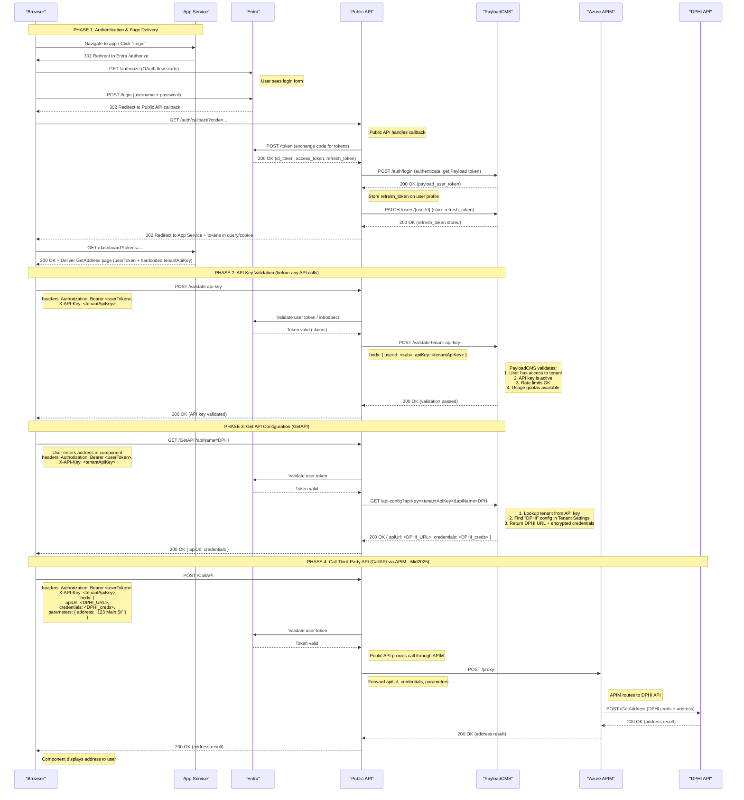

# Prototype Authentication & Authorization Flow

## Overview

This sequence diagram illustrates the end-to-end authentication and authorization flow for accessing third-party API resources (e.g., DPHI) through the Public API. The flow demonstrates a multi-layered security approach that combines user authentication via Entra (Microsoft Identity Platform) with tenant-based access control and business logic execution managed through PayloadCMS.

**Key Architectural Principle**: Public API is a lightweight RESTful gateway with three main endpoints:
1. **Authentication endpoints** - Handle OAuth flow and token management
2. **GetAPI** - Retrieve API configurations and credentials from PayloadCMS
3. **CallAPI** - Proxy calls to third-party APIs through Azure APIM (Mid2025)

## System Components

- **Browser**: The user's web browser displaying the application UI
- **App Service**: The application server that delivers web pages and components (e.g., Next.js, React SSR)
- **Entra**: Microsoft's identity and access management service (formerly Azure AD)
- **Public API**: Lightweight RESTful API gateway with three main endpoints:
  - `/auth/*` - OAuth flow and token management
  - `/validate-api-key` - Validates tenant API key for usage tracking, rate limiting, and authorization
  - `/GetAPI` - Retrieves API configurations and credentials from PayloadCMS
  - `/CallAPI` - Proxies calls to third-party APIs through Azure APIM
- **PayloadCMS**: Content management system that:
  - Stores tenant configurations (including Tenant API Keys)
  - Manages user access per tenant
  - Stores third-party API configurations per tenant (e.g., "DPHI" with URL and encrypted credentials)
  - Validates API keys and enforces usage limits, pricing, and rate limiting
- **Azure APIM**: API Management service that proxies calls to third-party APIs (Mid2025 integration)
- **DPHI API**: The downstream data provider API (accessed through APIM, planned for Mid-2025 integration)

## Flow Description

The flow is divided into two main phases:

### Phase 1: User Authentication (App Service orchestrates page delivery)

1. User navigates to the application in their browser
2. App Service delivers the login page/component to the browser
3. User clicks "Login" button in the browser
4. App Service initiates OAuth flow with Entra (redirects user to Entra login)
5. User sees Entra's login page and enters credentials (username and password)
6. Upon successful authentication, Entra redirects to Public API callback with auth code
7. Public API exchanges auth code with Entra for id_token, access_token, and refresh_token
8. Public API authenticates with PayloadCMS and retrieves Payload user token
9. Public API stores the Entra refresh_token on the user's profile in PayloadCMS
10. Public API redirects browser back to App Service with both Entra token and Payload token
11. App Service delivers the GetAddress page/component to the browser (with both tokens)

**Token Refresh Flow**: When the Payload token expires, Public API uses the stored refresh_token to obtain a new Entra token from Entra, then generates a new Payload token, updating both in the user session.

### Phase 2: API Key Validation (Before any API calls)

**Important**: Before making any API calls (other than login), the component must validate its API key.

**Standard Request Format**: All Public API calls (except auth endpoints) include:
- `Authorization: Bearer <userToken>` header
- `X-API-Key: <tenantApiKey>` header
- Request-specific parameters in the body

1. **API Key Validation Request**: Component sends POST to `/validate-api-key`:
   - Headers: `Authorization: Bearer <userToken>`, `X-API-Key: <tenantApiKey>`

2. **Validation Process**:
   - Public API validates user token with Entra
   - Public API calls PayloadCMS to validate the API key
   - PayloadCMS checks:
     - User has access to the tenant associated with this API key
     - API key is active and valid
     - Rate limits not exceeded
     - Usage quotas available
   - Returns validation status

3. **Result**: If valid, component can proceed with API calls. All subsequent calls include both tokens.

### Phase 3: Get API Configuration (GetAPI)

When the user interacts with the GetAddress component (e.g., enters an address):

1. **GetAPI Request**: Component sends GET to `/GetAPI` with:
   - Headers: `Authorization: Bearer <userToken>`, `X-API-Key: <tenantApiKey>`
   - Query params: `?apiName=DPHI`

2. **Retrieve Configuration**: Public API calls PayloadCMS to:
   - Look up tenant from API key
   - Find API configuration named "DPHI" in Tenant Settings collection
   - Retrieve DPHI API URL and encrypted credentials
   - Return to Public API

3. **Response**: Public API returns to browser component:
   - DPHI API URL
   - DPHI API credentials (encrypted or as needed by component)

### Phase 4: Call Third-Party API (CallAPI via APIM)

**Mid2025 Implementation**: Calls route through Azure APIM

1. **CallAPI Request**: Component sends POST to `/CallAPI` with:
   - Headers: `Authorization: Bearer <userToken>`, `X-API-Key: <tenantApiKey>`
   - Body: `{ apiUrl: <DPHI_URL>, credentials: <DPHI_creds>, parameters: { address: "..." } }`

2. **Proxy Through APIM**: Public API forwards the request to Azure APIM:
   - APIM receives the DPHI API URL, credentials, and parameters
   - APIM makes the actual call to DPHI API
   - DPHI processes the request and returns address data

3. **Response Chain**:
   - DPHI → APIM → Public API → Browser Component
   - Component displays the address results to the user

## Security Features

- **Multi-layer authentication**: User token (Entra) + Tenant API key for every request
- **API key management**: Usage tracking, rate limiting, and pricing per tenant API key
- **Encrypted credentials**: Third-party API credentials stored encrypted in PayloadCMS
- **Token-based authentication**: Short-lived bearer tokens prevent unauthorized access
- **Secure token storage**: Entra refresh tokens stored securely in PayloadCMS on user profiles
- **Token refresh mechanism**: Automatic token refresh using stored refresh_token when Payload token expires
- **APIM Gateway**: All third-party API calls routed through Azure APIM for security and monitoring

## Implementation Timeline

The DPHI API integration is planned for Mid-2025 (as noted in the diagram).

