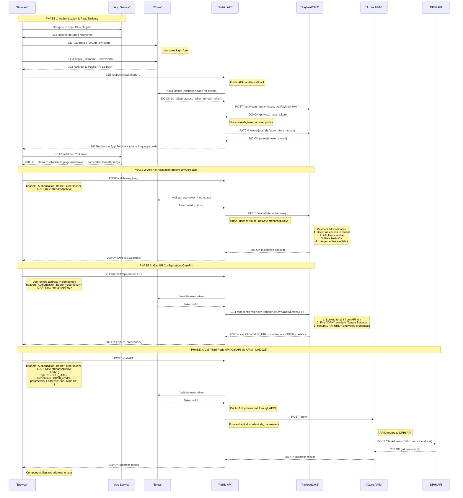

# Component-to-Public API Integration Template

## Overview

This sequence diagram serves as the **canonical template** for how all components in the system will interact with the Public API. While this example uses the GetAddress component calling the DPHI API, the same four-phase pattern applies to all component types accessing any third-party API.

The flow demonstrates a multi-layered security approach that combines user authentication via Entra (Microsoft Identity Platform) with tenant-based access control and API key management through PayloadCMS.

## Template Pattern

**All components follow this standard flow:**
1. **Phase 1**: User authenticates and receives tokens (one-time per session)
2. **Phase 2**: Component validates its tenant API key (once per component initialization)
3. **Phase 3**: Component retrieves third-party API configuration via `GetAPI` (as needed)
4. **Phase 4**: Component makes API calls via `CallAPI` through APIM (per user interaction)

This pattern ensures consistent security, monitoring, and usage tracking across all component types.

**Key Architectural Principle**: Public API is a lightweight RESTful gateway with three main endpoints:
1. **Authentication endpoints** - Handle OAuth flow and token management
2. **GetAPI** - Retrieve API configurations and credentials from PayloadCMS
3. **CallAPI** - Proxy calls to third-party APIs through Azure APIM (Mid2025)

## System Components

- **Browser**: The user's web browser displaying the application UI
- **App Service**: The application server that delivers web pages and components (e.g., Next.js, React SSR)
- **Entra**: Microsoft's identity and access management service (formerly Azure AD)
- **Public API**: Lightweight RESTful API gateway with three main endpoints:
  - `/auth/*` - OAuth flow and token management
  - `/validate-api-key` - Validates tenant API key for usage tracking, rate limiting, and authorization
  - `/GetAPI` - Retrieves API configurations and credentials from PayloadCMS
  - `/CallAPI` - Proxies calls to third-party APIs through Azure APIM
- **PayloadCMS**: Content management system that:
  - Stores tenant configurations (including Tenant API Keys)
  - Manages user access per tenant
  - Stores third-party API configurations per tenant (e.g., "DPHI" with URL and encrypted credentials)
  - Validates API keys and enforces usage limits, pricing, and rate limiting
- **Azure APIM**: API Management service that proxies calls to third-party APIs (Mid2025 integration)
- **DPHI API**: The downstream data provider API (accessed through APIM, planned for Mid-2025 integration)

## Flow Description

This template describes the interaction pattern that **all components must follow** when integrating with the Public API. The GetAddress component and DPHI API serve as the reference implementation.

### How to Apply This Template to Other Components

1. **Replace the component**: GetAddress → YourComponent (e.g., PaymentProcessor, DocumentValidator)
2. **Replace the API**: DPHI → YourAPI (e.g., Stripe, DocuSign)
3. **Replace the parameters**: `address` → your component-specific parameters
4. **Keep the flow identical**: The four-phase pattern, authentication, and API key validation remain the same

### The Four Phases

### Phase 1: User Authentication (One-time per session)

**Applies to**: All components and all users
**Frequency**: Once per user session

This phase establishes the user's identity and provides tokens for subsequent API calls.

1. User navigates to the application in their browser
2. App Service delivers the login page/component to the browser
3. User clicks "Login" button in the browser
4. App Service initiates OAuth flow with Entra (redirects user to Entra login)
5. User sees Entra's login page and enters credentials (username and password)
6. Upon successful authentication, Entra redirects to Public API callback with auth code
7. Public API exchanges auth code with Entra for id_token, access_token, and refresh_token
8. Public API authenticates with PayloadCMS and retrieves Payload user token
9. Public API stores the Entra refresh_token on the user's profile in PayloadCMS
10. Public API redirects browser back to App Service with both Entra token and Payload token
11. App Service delivers the component page (e.g., GetAddress) to the browser with both tokens

**Token Refresh Flow**: When the Payload token expires, Public API uses the stored refresh_token to obtain a new Entra token from Entra, then generates a new Payload token, updating both in the user session.

**Template Note**: This phase is identical for all components. The user authenticates once, and all components in the session use the same tokens.

### Phase 2: API Key Validation (Once per component initialization)

**Applies to**: All components
**Frequency**: Once when component mounts/initializes
**Purpose**: Validates authorization and enforces usage tracking, rate limiting, and pricing

**Standard Request Format for ALL Public API calls** (except auth endpoints):
- `Authorization: Bearer <userToken>` header
- `X-API-Key: <tenantApiKey>` header
- Request-specific parameters in the body

#### Validation Flow

1. **API Key Validation Request**: Component sends POST to `/validate-api-key`:
   - Headers: `Authorization: Bearer <userToken>`, `X-API-Key: <tenantApiKey>`

2. **Validation Process**:
   - Public API validates user token with Entra
   - Public API calls PayloadCMS to validate the API key
   - PayloadCMS checks:
     - User has access to the tenant associated with this API key
     - API key is active and valid
     - Rate limits not exceeded
     - Usage quotas available
   - Returns validation status

3. **Result**: If valid, component can proceed with API calls. All subsequent calls include both tokens.

**Template Note**: Every component must perform this validation before making GetAPI or CallAPI requests. The tenant API key is hardcoded in the component and identifies which tenant's configuration and billing to use.

### Phase 3: Get API Configuration (GetAPI)

**Applies to**: All components that need third-party API credentials
**Frequency**: As needed (typically once, can be cached)
**Purpose**: Retrieve API endpoint URL and credentials for the third-party service

When the user interacts with a component (e.g., enters an address in GetAddress):

#### GetAPI Flow

1. **GetAPI Request**: Component sends GET to `/GetAPI` with:
   - Headers: `Authorization: Bearer <userToken>`, `X-API-Key: <tenantApiKey>`
   - Query params: `?apiName={API_NAME}`
   - **Example**: `?apiName=DPHI` for GetAddress, `?apiName=Stripe` for PaymentProcessor

2. **Retrieve Configuration**: Public API calls PayloadCMS to:
   - Look up tenant from API key
   - Find API configuration named `{API_NAME}` in Tenant Settings collection
   - Retrieve third-party API URL and encrypted credentials (pre-configured by tenant admin)
   - Return to Public API

3. **Response**: Public API returns to browser component:
   - Third-party API URL
   - API credentials (encrypted or as needed by component)

**Template Note**: The tenant admin must pre-configure each third-party API in PayloadCMS Tenant Settings. This includes the API name (e.g., "DPHI", "Stripe"), endpoint URL, and encrypted credentials. Components request configuration by API name.

### Phase 4: Call Third-Party API (CallAPI via APIM)

**Applies to**: All components making third-party API calls
**Frequency**: Per user interaction (e.g., every address lookup, payment, document validation)
**Purpose**: Execute the actual third-party API call through a secure gateway

**Mid2025 Implementation**: All calls route through Azure APIM for security, monitoring, and centralized management

#### CallAPI Flow

1. **CallAPI Request**: Component sends POST to `/CallAPI` with:
   - Headers: `Authorization: Bearer <userToken>`, `X-API-Key: <tenantApiKey>`
   - Body: `{ apiUrl: <API_URL>, credentials: <API_creds>, parameters: {...} }`
   - **Example for GetAddress**: `{ apiUrl: <DPHI_URL>, credentials: <DPHI_creds>, parameters: { address: "123 Main St" } }`
   - **Example for PaymentProcessor**: `{ apiUrl: <Stripe_URL>, credentials: <Stripe_creds>, parameters: { amount: 100, currency: "USD" } }`

2. **Proxy Through APIM**: Public API forwards the request to Azure APIM:
   - APIM receives the third-party API URL, credentials, and parameters
   - APIM makes the actual call to the third-party API
   - Third-party API processes the request and returns results

3. **Response Chain**:
   - Third-party API → APIM → Public API → Browser Component
   - Component displays the results to the user

**Template Note**: This is where component-specific business logic executes. The parameters vary by component type and third-party API, but the flow pattern remains identical. APIM provides centralized logging, rate limiting, and security for all third-party API calls.

## Security Features

- **Multi-layer authentication**: User token (Entra) + Tenant API key for every request
- **API key management**: Usage tracking, rate limiting, and pricing per tenant API key
- **Encrypted credentials**: Third-party API credentials stored encrypted in PayloadCMS
- **Token-based authentication**: Short-lived bearer tokens prevent unauthorized access
- **Secure token storage**: Entra refresh tokens stored securely in PayloadCMS on user profiles
- **Token refresh mechanism**: Automatic token refresh using stored refresh_token when Payload token expires
- **APIM Gateway**: All third-party API calls routed through Azure APIM for security and monitoring

## Implementation Timeline

The DPHI API integration and Azure APIM routing are planned for Mid-2025 (as noted in the diagram).

## Implementing New Components Using This Template

### Component Development Checklist

When creating a new component that integrates with a third-party API, follow this checklist:

#### 1. Component Setup
- [ ] Embed tenant API key (hardcoded in component)
- [ ] Implement authentication token storage (from Phase 1)
- [ ] Add API key validation on component mount (Phase 2)

#### 2. Third-Party API Configuration
- [ ] Tenant admin configures the third-party API in PayloadCMS:
  - API name (e.g., "Stripe", "DocuSign", "DPHI")
  - API endpoint URL
  - Encrypted API credentials
  - Rate limits and usage quotas

#### 3. Component Logic
- [ ] Call `GET /GetAPI?apiName={YOUR_API}` to retrieve configuration (Phase 3)
- [ ] Store API URL and credentials (consider caching)
- [ ] On user interaction, call `POST /CallAPI` with:
  - `apiUrl`: from GetAPI response
  - `credentials`: from GetAPI response
  - `parameters`: component-specific data

#### 4. Error Handling
- [ ] Handle 401 (unauthorized) - redirect to login
- [ ] Handle 403 (forbidden) - insufficient tenant access
- [ ] Handle 429 (rate limit exceeded) - show appropriate message
- [ ] Handle third-party API errors - display user-friendly messages

### Example Component Types

| Component Type | API Name | Parameters Example |
|----------------|----------|-------------------|
| GetAddress | DPHI | `{ address: "123 Main St" }` |
| PaymentProcessor | Stripe | `{ amount: 100, currency: "USD", paymentMethod: "card" }` |
| DocumentValidator | DocuSign | `{ documentId: "abc123", signers: [...] }` |
| EmailSender | SendGrid | `{ to: "user@example.com", subject: "...", body: "..." }` |
| SMSNotifier | Twilio | `{ phoneNumber: "+1234567890", message: "..." }` |

### Standard Request Headers (All Components)

```javascript
// Every API call (except auth) must include these headers
const headers = {
  'Authorization': `Bearer ${userToken}`,
  'X-API-Key': TENANT_API_KEY, // Hardcoded in component
  'Content-Type': 'application/json'
};
```

### Component Lifecycle Summary

```
Component Mount
  ↓
1. POST /validate-api-key (validate tenant API key)
  ↓
User Interaction
  ↓
2. GET /GetAPI?apiName={API} (get third-party API config - cache if possible)
  ↓
3. POST /CallAPI (make actual API call through APIM)
  ↓
Display Results
```

This consistent pattern ensures:
- Uniform security across all components
- Centralized usage tracking and billing per tenant
- Easy monitoring and debugging through APIM
- Simplified component development (follow the template)


