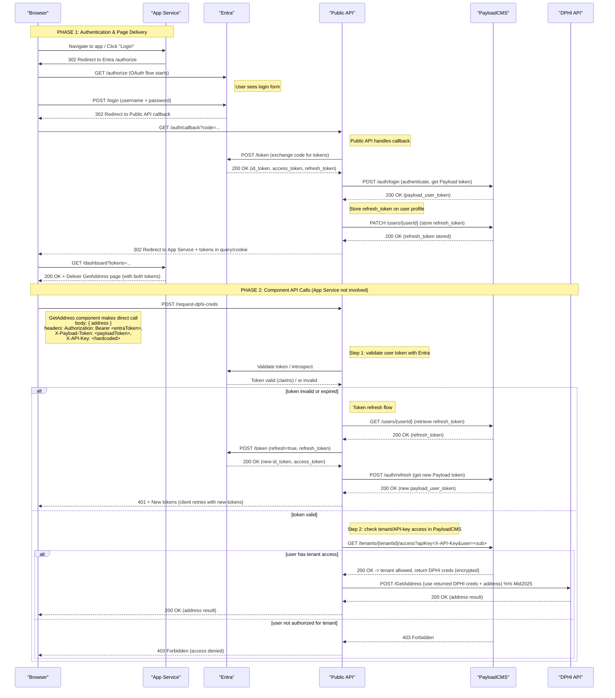

# Prototype Authentication & Authorization Flow

## Overview

This sequence diagram illustrates the end-to-end authentication and authorization flow for accessing DPHI API resources through the Public API. The flow demonstrates a multi-layered security approach that combines user authentication via Entra (Microsoft Identity Platform) with tenant-based access control managed through PayloadCMS.

## System Components

- **Browser**: The user's web browser displaying the application UI
- **App Service**: The application server that delivers web pages and components (e.g., Next.js, React SSR)
- **Entra**: Microsoft's identity and access management service (formerly Azure AD)
- **Public API**: The backend API gateway that orchestrates authentication and authorization
- **PayloadCMS**: Content management system that stores tenant configurations and access permissions
- **DPHI API**: The downstream data provider API (planned for Mid-2025 integration)

## Flow Description

The flow is divided into two main phases:

### Phase 1: User Authentication (App Service orchestrates page delivery)

1. User navigates to the application in their browser
2. App Service delivers the login page/component to the browser
3. User clicks "Login" button in the browser
4. App Service initiates OAuth flow with Entra (redirects user to Entra login)
5. User sees Entra's login page and enters credentials (username and password)
6. Upon successful authentication, Entra redirects to Public API callback with auth code
7. Public API exchanges auth code with Entra for id_token, access_token, and refresh_token
8. Public API authenticates with PayloadCMS and retrieves Payload user token
9. Public API stores the Entra refresh_token on the user's profile in PayloadCMS
10. Public API redirects browser back to App Service with both Entra token and Payload token
11. App Service delivers the GetAddress page/component to the browser (with both tokens)

**Token Refresh Flow**: When the Payload token expires, Public API uses the stored refresh_token to obtain a new Entra token from Entra, then generates a new Payload token, updating both in the user session.

### Phase 2: Authorization & Resource Access (Browser component directly calls Public API)

**Important**: The App Service is NOT involved in this phase. The GetAddress component in the browser makes direct API calls.

When the user interacts with the GetAddress component (e.g., enters an address):

1. **Request Submission**: GetAddress component in browser sends POST request directly to Public API at `/request-dphi-creds` with:
   - The address data in the request body
   - User's bearer token in the Authorization header (from session)
   - A hardcoded API key in the X-API-Key header

2. **Token Validation**: Public API validates the user's token with Entra
   - If invalid → returns 401 Unauthorized to browser
   - If valid → proceeds to tenant access check

3. **Tenant Access Control**: Public API checks with PayloadCMS to verify:
   - The user (identified by token subject/sub claim) has access to the tenant
   - The provided API key is valid for the tenant

4. **DPHI Credential Management**:
   - If authorized → PayloadCMS returns encrypted DPHI credentials
   - Public API uses these credentials to call DPHI's GetAddress endpoint
   - Results are returned directly to the browser component
   - If not authorized → returns 403 Forbidden to browser

## Security Features

- **Two-factor verification**: Both user identity (via Entra token) and tenant membership (via PayloadCMS) must be validated
- **Encrypted credentials**: DPHI API credentials are stored encrypted in PayloadCMS
- **Token-based authentication**: Short-lived bearer tokens prevent unauthorized access
- **API key validation**: Additional layer of access control per tenant
- **Secure token storage**: Entra refresh tokens are stored securely in PayloadCMS on user profiles
- **Token refresh mechanism**: Automatic token refresh using stored refresh_token when Payload token expires

## Implementation Timeline

The DPHI API integration is planned for Mid-2025 (as noted in the diagram).

