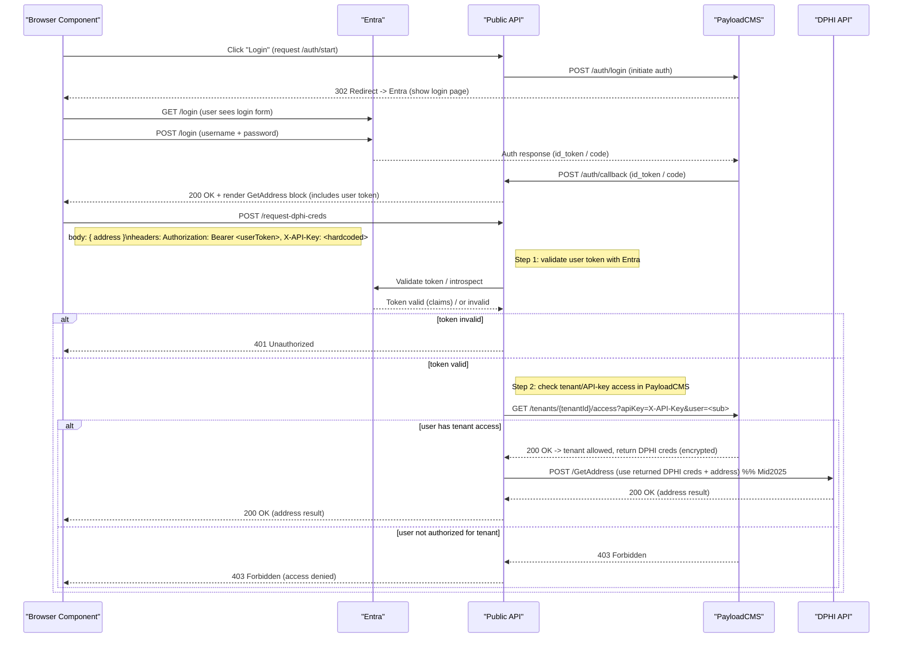

# Prototype Authentication & Authorization Flow

## Overview

This sequence diagram illustrates the end-to-end authentication and authorization flow for accessing DPHI API resources through the Public API. The flow demonstrates a multi-layered security approach that combines user authentication via Entra (Microsoft Identity Platform) with tenant-based access control managed through PayloadCMS.

## System Components

- **Browser Component (BC)**: The client-side application where users interact with the system
- **Entra**: Microsoft's identity and access management service (formerly Azure AD)
- **Public API**: The backend API gateway that orchestrates authentication and authorization
- **PayloadCMS**: Content management system that stores tenant configurations and access permissions
- **DPHI API**: The downstream data provider API (planned for Mid-2025 integration)

## Flow Description

The flow is divided into two main phases:

### Phase 1: User Authentication

1. User clicks "Login" in the browser, initiating the authentication process
2. Public API coordinates with PayloadCMS to start the login flow
3. User is redirected to Entra's login page
4. User enters credentials (username and password)
5. Upon successful authentication, Entra returns an ID token/auth code to PayloadCMS
6. The callback is processed and the user receives a token to use for subsequent requests
7. The GetAddress UI component is rendered, including the user's authentication token

### Phase 2: Authorization & Resource Access

When the user attempts to access DPHI resources:

1. **Request Submission**: Browser sends a POST request to `/request-dphi-creds` with:
   - The address data in the request body
   - User's bearer token in the Authorization header
   - A hardcoded API key in the X-API-Key header

2. **Token Validation**: Public API validates the user's token with Entra
   - If invalid → returns 401 Unauthorized
   - If valid → proceeds to tenant access check

3. **Tenant Access Control**: Public API checks with PayloadCMS to verify:
   - The user (identified by token subject/sub claim) has access to the tenant
   - The provided API key is valid for the tenant

4. **DPHI Credential Management**:
   - If authorized → PayloadCMS returns encrypted DPHI credentials
   - Public API uses these credentials to call DPHI's GetAddress endpoint
   - Results are returned to the browser
   - If not authorized → returns 403 Forbidden

## Security Features

- **Two-factor verification**: Both user identity (via Entra token) and tenant membership (via PayloadCMS) must be validated
- **Encrypted credentials**: DPHI API credentials are stored encrypted in PayloadCMS
- **Token-based authentication**: Short-lived bearer tokens prevent unauthorized access
- **API key validation**: Additional layer of access control per tenant

## Implementation Timeline

The DPHI API integration is planned for Mid-2025 (as noted in the diagram).

