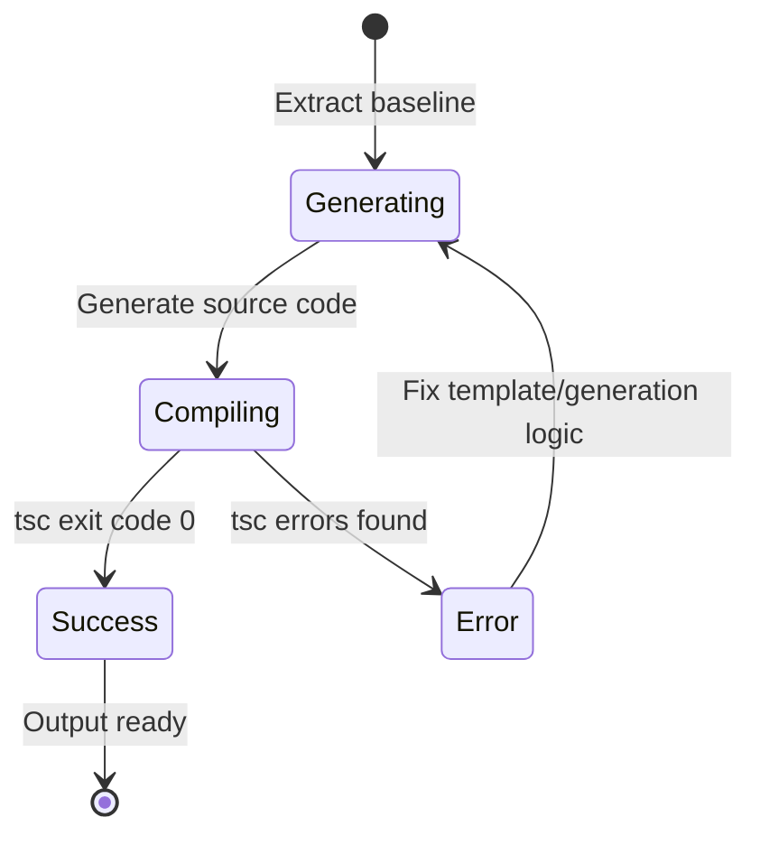
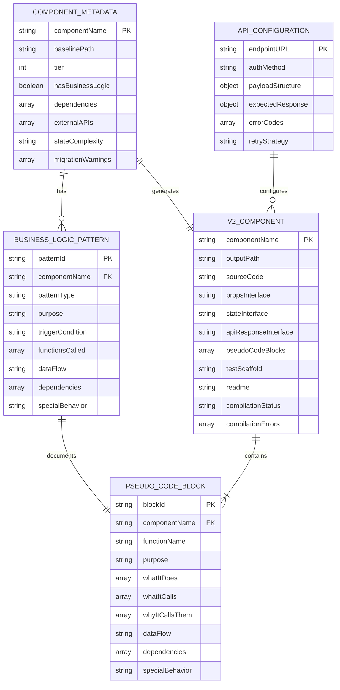
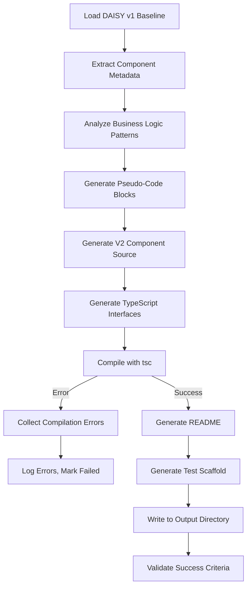
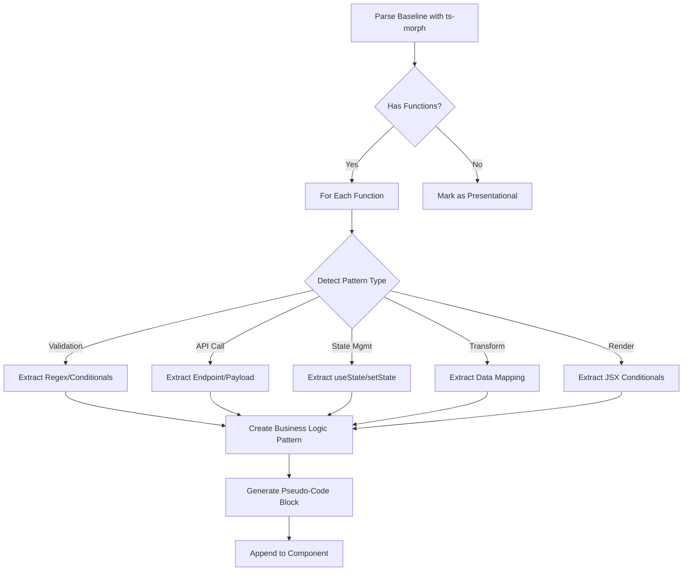

# Phase 1: Data Model

**Feature**: 004-v2-getaddress-component  
**Generated**: 2025-10-24  
**Status**: Complete

## Entity Definitions

### 1. Component Metadata

**Purpose**: Information extracted during baseline analysis to guide V2 generation

**Fields**:

| Field | Type | Description | Validation |
|-------|------|-------------|------------|
| componentName | string | Component name (e.g., "GetAddressCard") | Required, PascalCase |
| baselinePath | string | Absolute path to DAISY v1 baseline | Required, must exist |
| tier | 1\|2\|3\|4 | Component complexity tier | Required |
| hasBusinessLogic | boolean | Whether component has business logic to extract | Required |
| dependencies | string[] | Other DAISY v1 components this depends on | Optional, default [] |
| externalAPIs | string[] | Third-party APIs called (e.g., ["DPHI"]) | Optional, default [] |
| stateComplexity | "simple"\|"moderate"\|"complex" | State management complexity | Required |
| migrationWarnings | string[] | Known issues or breaking changes | Optional, default [] |

**Relationships**:

- One Component Metadata → Many Business Logic Patterns (1:N)
- One Component Metadata → One V2 Component (1:1)

**State Transitions**: N/A (immutable after extraction)

**Validation Rules**:

- componentName must match baseline file name (e.g., useRenderAddressCard → GetAddressCard)
- baselinePath must point to existing file
- tier must match extraction pipeline output (from 001-component-extraction-pipeline)

---

### 2. Business Logic Pattern

**Purpose**: Extracted patterns from baseline for pseudo-code generation

**Fields**:

| Field | Type | Description | Validation |
|-------|------|-------------|------------|
| patternId | string | Unique identifier (UUID) | Required, unique |
| componentName | string | Parent component | Required |
| patternType | "validation"\|"api-call"\|"state-mgmt"\|"transform"\|"render" | Pattern category | Required |
| purpose | string | High-level purpose (e.g., "Validate UK postcode") | Required, 10-200 chars |
| triggerCondition | string | When this logic executes (e.g., "User clicks Search") | Optional |
| functionsCalled | string[] | Functions invoked in this pattern | Optional, default [] |
| dataFlow | string | Input → Processing → Output description | Required |
| dependencies | string[] | External utilities or libraries | Optional, default [] |
| specialBehavior | string | Edge cases or non-obvious behavior | Optional |

**Relationships**:

- Many Business Logic Patterns → One Component Metadata (N:1)
- One Business Logic Pattern → One JSDoc Block (1:1)

**Validation Rules**:

- purpose must be specific, not generic (e.g., "Validate UK postcode format" not "Validate input")
- dataFlow must include at least input and output
- If patternType is "api-call", must include endpoint in functionsCalled

---

### 3. V2 Component

**Purpose**: Generated Configurator V2 component output

**Fields**:

| Field | Type | Description | Validation |
|-------|------|-------------|------------|
| componentName | string | Component name (e.g., "GetAddressCard") | Required, PascalCase |
| outputPath | string | Generated file path | Required, in packages/v2-components/src/ |
| sourceCode | string | Generated TypeScript/React code | Required, must compile |
| propsInterface | string | TypeScript Props interface | Required |
| stateInterface | string | TypeScript State interface | Optional |
| apiResponseInterface | string | TypeScript API Response interface | Optional |
| pseudoCodeBlocks | PseudoCodeBlock[] | Generated JSDoc pseudo-code | Required, ≥1 block |
| testScaffold | string | Generated test file content | Optional |
| readme | string | Generated README content | Required |
| compilationStatus | "pending"\|"success"\|"error" | TypeScript compilation result | Required |
| compilationErrors | string[] | TypeScript errors if any | Optional, default [] |

**Relationships**:

- One V2 Component → One Component Metadata (1:1)
- One V2 Component → Many PseudoCodeBlocks (1:N)

**State Transitions**:



**Validation Rules**:

- sourceCode must pass TypeScript 5.0+ strict mode compilation (SC-002)
- pseudoCodeBlocks must contain ≥15 specific statements total (SC-003)
- All sequence 2 integration points must be covered in pseudo-code (SC-004)
- readme must be ≤500 words (SC-006)

---

### 4. Pseudo-Code Block

**Purpose**: Single JSDoc block documenting business logic

**Fields**:

| Field | Type | Description | Validation |
|-------|------|-------------|------------|
| blockId | string | Unique identifier (UUID) | Required, unique |
| componentName | string | Parent component | Required |
| functionName | string | Function this documents (e.g., "validateAddressInput") | Required |
| purpose | string | WHY THIS EXISTS explanation | Required, 20-200 chars |
| whatItDoes | string[] | WHAT IT DOES bullet points | Required, 1-10 items |
| whatItCalls | string[] | WHAT IT CALLS function names | Optional, default [] |
| whyItCallsThem | string[] | WHY IT CALLS THEM explanations | Optional, default [] |
| dataFlow | string | DATA FLOW description | Required |
| dependencies | string[] | DEPENDENCIES list | Optional, default [] |
| specialBehavior | string | SPECIAL BEHAVIOR notes | Optional |

**Relationships**:

- Many Pseudo-Code Blocks → One V2 Component (N:1)
- One Pseudo-Code Block → One Business Logic Pattern (1:1)

**Validation Rules**:

- whatItDoes must have at least 1 specific statement (no generic "TODO: implement")
- If whatItCalls is non-empty, whyItCallsThem must have same length
- dataFlow must include "→" arrows showing transformation steps
- All fields combined must result in ≥3 non-empty lines in JSDoc

---

### 5. API Configuration

**Purpose**: Public API integration requirements for component

**Fields**:

| Field | Type | Description | Validation |
|-------|------|-------------|------------|
| endpointURL | string | API endpoint (e.g., "/api/v1/proxy") | Required, must start with / |
| authMethod | "session-cookie"\|"bearer-token"\|"api-key" | Authentication method | Required |
| payloadStructure | object | Request payload schema | Required |
| expectedResponse | object | Response schema | Required |
| errorCodes | ErrorCode[] | Possible error responses | Required, ≥1 |
| retryStrategy | string | How to handle retries (e.g., "Exponential backoff for 429") | Optional |

**Nested Type: ErrorCode**:

| Field | Type | Description | Validation |
|-------|------|-------------|------------|
| statusCode | number | HTTP status code (e.g., 429) | Required, 100-599 |
| errorType | string | Error category (e.g., "rate-limit") | Required |
| userMessage | string | User-facing error message | Required |
| retryAfter | number \| null | Seconds to wait before retry | Optional |

**Relationships**:

- One API Configuration → Many V2 Components (1:N) (shared across components using same API)

**Validation Rules**:

- payloadStructure must match sequence 2 specification: `{ tenantApiName, operation, parameters }`
- errorCodes must include at least 429 (rate limit) and 401 (unauthorized)
- If authMethod is "session-cookie", no bearer token fields

**Example for GetAddressCard**:

```typescript
{
  endpointURL: "/api/v1/proxy",
  authMethod: "session-cookie",
  payloadStructure: {
    tenantApiName: "DPHI",
    operation: "getaddress",
    parameters: { address: "string" }
  },
  expectedResponse: {
    address: {
      line1: "string",
      line2: "string",
      city: "string",
      postcode: "string",
      uprn: "string",
      councilName: "string"
    }
  },
  errorCodes: [
    { statusCode: 429, errorType: "rate-limit", userMessage: "Too many requests, try again in {retryAfter}s", retryAfter: 3600 },
    { statusCode: 401, errorType: "unauthorized", userMessage: "Session expired, please log in again", retryAfter: null },
    { statusCode: 503, errorType: "service-unavailable", userMessage: "Service temporarily unavailable", retryAfter: 60 }
  ],
  retryStrategy: "Exponential backoff for 429, no retry for 401, immediate retry for 503"
}
```

---

## Entity Relationships Diagram



---

## Data Flow

### Generation Pipeline Flow



### Business Logic Extraction Flow



---

## Validation Matrix

| Entity | Validation Type | Check | Pass Criteria |
|--------|----------------|-------|---------------|
| Component Metadata | Existence | baselinePath file exists | File.exists() = true |
| Component Metadata | Format | componentName is PascalCase | Regex: `^[A-Z][a-zA-Z0-9]+$` |
| Business Logic Pattern | Specificity | purpose is specific | Does not contain "TODO" or "implement" |
| Business Logic Pattern | Completeness | dataFlow has input/output | Contains "→" and ≥2 terms |
| V2 Component | Compilation | sourceCode compiles | tsc exit code = 0 |
| V2 Component | Statement Count | pseudoCodeBlocks total ≥15 statements | Count non-empty lines ≥15 |
| V2 Component | Sequence 2 Coverage | Covers all 5 integration points | Keywords: session, proxy, 429, logging, error |
| Pseudo-Code Block | Non-Generic | whatItDoes has specific statements | No "TODO" or "implement" |
| Pseudo-Code Block | Call Documentation | whyItCallsThem length = whatItCalls length | Array lengths match |
| API Configuration | Payload Match | payloadStructure matches sequence 2 | Has tenantApiName, operation, parameters |
| API Configuration | Error Coverage | errorCodes includes 429, 401 | statusCode array includes both |

All entities ready for contract generation (Phase 1 next step).
