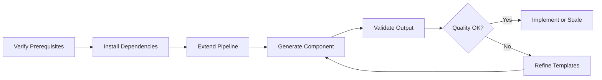

# Quickstart: GetAddressCard V2 Component Generation

**Feature**: 004-v2-getaddress-component  
**Estimated Time**: 15 minutes  
**Prerequisites**: Completed 001-component-extraction-pipeline

---

## Step 1: Verify Prerequisites (2 minutes)

### Check Baseline Exists

```bash
# Verify GetAddressCard baseline was extracted
ls -la daisyv1/components/tier1-simple/useRenderAddressCard/

# Expected output:
# useRenderAddressCard.tsx
# README.md
```

### Check Dependencies

```bash
# Verify TypeScript and Node versions
node --version  # Should be v18+
npx tsc --version  # Should be 5.0+

# Verify Jest installed
npm list jest  # Should show jest@29+
```

**Success Indicator**: All files exist, versions meet requirements

---

## Step 2: Install New Dependencies (3 minutes)

### Add Configurator SDK and shadcn/ui

```bash
# Install Configurator SDK
npm install @elevenlabs-ui/configurator-sdk@^2.1.0

# Install shadcn/ui components
npx shadcn-ui@latest add button input alert toast

# Install development dependencies
npm install --save-dev @types/react@^18.0.0 @types/react-dom@^18.0.0
```

### Initialize V2 Components Package

```bash
# Create package structure
mkdir -p packages/v2-components/src/components
mkdir -p packages/v2-components/__tests__

# Create package.json
cat > packages/v2-components/package.json << 'EOF'
{
  "name": "@daisy/v2-components",
  "version": "0.1.0",
  "description": "DAISY Configurator V2 Components",
  "main": "dist/index.js",
  "types": "dist/index.d.ts",
  "files": ["dist"],
  "scripts": {
    "build": "tsc --project tsconfig.json",
    "test": "jest"
  },
  "peerDependencies": {
    "react": "^18.0.0",
    "react-dom": "^18.0.0"
  },
  "dependencies": {
    "@elevenlabs-ui/configurator-sdk": "^2.1.0"
  }
}
EOF

# Create tsconfig.json
cat > packages/v2-components/tsconfig.json << 'EOF'
{
  "extends": "../../tsconfig.json",
  "compilerOptions": {
    "jsx": "react-jsx",
    "outDir": "./dist",
    "rootDir": "./src",
    "declaration": true,
    "declarationMap": true
  },
  "include": ["src/**/*"],
  "exclude": ["node_modules", "dist", "__tests__"]
}
EOF
```

**Success Indicator**: `npm install` completes without errors, package.json created

---

## Step 3: Extend Pipeline with V2 Generator (5 minutes)

### Create Business Logic Analyzer

```bash
# Create new utility file
touch src/utils/business-logic-analyzer.ts
```

**Add to `src/utils/business-logic-analyzer.ts`**:

```typescript
import { Project, SourceFile, SyntaxKind } from 'ts-morph';

export interface BusinessLogicPattern {
  patternId: string;
  patternType: 'validation' | 'api-call' | 'state-mgmt' | 'transform' | 'render';
  purpose: string;
  functionsCalled: string[];
  dataFlow: string;
  dependencies: string[];
}

export class BusinessLogicAnalyzer {
  async analyzeBaseline(baselinePath: string): Promise<BusinessLogicPattern[]> {
    const project = new Project();
    const sourceFile = project.addSourceFileAtPath(baselinePath);

    // High-level analysis - Phase 1 implementation
    // Detailed parsing deferred to Phase 2
    return this.extractPatterns(sourceFile);
  }

  private extractPatterns(sourceFile: SourceFile): BusinessLogicPattern[] {
    const patterns: BusinessLogicPattern[] = [];

    // Find validation patterns (regex, type guards)
    // Find API call patterns (fetch, axios)
    // Find state management patterns (useState, setState)
    // TODO: Implement in actual development phase

    return patterns;
  }
}
```

### Extend V2 Generator

**Update `src/pipeline/generators/v2-generator.ts`**:

Add pseudo-code generation logic (see contracts/api-contract.md for full interface).

### Add CLI Command

**Update `src/cli/migrate-component.ts`**:

```typescript
// Add --generate-v2 flag
program
  .option('--generate-v2', 'Generate Configurator V2 component')
  .action(async (options) => {
    if (options.generateV2) {
      const result = await generateV2Component({
        componentName: options.component,
        baselinePath: `daisyv1/components/${options.component}`,
      });
      console.log(JSON.stringify(result, null, 2));
    }
  });
```

**Success Indicator**: Files created, TypeScript compilation succeeds

---

## Step 4: Generate GetAddressCard V2 (3 minutes)

### Run Generation Command

```bash
# Generate GetAddressCard V2 component
npm run migrate:v2 -- --component=GetAddressCard --verbose

# Expected output:
# ✓ Analyzing baseline: daisyv1/components/tier1-simple/useRenderAddressCard
# ✓ Extracted 4 business logic patterns
# ✓ Generated 18 pseudo-code statements
# ✓ TypeScript compilation successful
# ✓ Generated files:
#   - packages/v2-components/src/components/GetAddressCard/GetAddressCard.tsx
#   - packages/v2-components/src/components/GetAddressCard/GetAddressCard.types.ts
#   - packages/v2-components/src/components/GetAddressCard/README.md
#   - packages/v2-components/src/components/GetAddressCard/__tests__/GetAddressCard.test.tsx
# ✓ Generation completed in 2.8s
```

### Verify Generated Component

```bash
# Check TypeScript compilation
cd packages/v2-components
npx tsc --noEmit

# Expected: No errors

# View generated pseudo-code
cat src/components/GetAddressCard/GetAddressCard.tsx | grep -A 20 "BUSINESS LOGIC"

# Expected: JSDoc blocks with WHY/WHAT/DATA FLOW sections
```

**Success Indicator**: Files generated, TypeScript compiles, pseudo-code present

---

## Step 5: Validate Success Criteria (2 minutes)

### Run Validation Tests

```bash
# Return to repo root
cd ../..

# Run validation suite
npm test -- --testNamePattern="V2 Generation"

# Expected tests:
# ✓ SC-001: Generation time < 30 seconds
# ✓ SC-002: Zero TypeScript compilation errors
# ✓ SC-003: Pseudo-code contains ≥15 statements
# ✓ SC-004: Sequence 2 coverage (session, proxy, 429, logging, error)
# ✓ SC-006: README ≤500 words
```

### Manual Review Checklist

```bash
# Open generated component in editor
code packages/v2-components/src/components/GetAddressCard/GetAddressCard.tsx
```

**Check**:

- [ ] Component has TypeScript interfaces for Props, State, APIResponse
- [ ] Pseudo-code includes "session validation" reference
- [ ] Pseudo-code includes "/api/v1/proxy" endpoint
- [ ] Pseudo-code includes "429" rate limit handling
- [ ] Pseudo-code includes "DPHI" API reference
- [ ] README has usage example
- [ ] README documents migration notes from DAISY v1

**Success Indicator**: All tests pass, manual checklist complete

---

## Next Steps

### Option A: Implement Real Component (4 hours)

Use generated pseudo-code to implement actual GetAddressCard component:

1. Replace pseudo-code placeholders with real implementation
2. Add API integration using sequence 2 patterns
3. Add shadcn/ui components for UI
4. Write unit tests in `__tests__/`
5. Test in Storybook

### Option B: Generate More Components

Repeat Step 4 for other tier-1 components:

```bash
npm run migrate:v2 -- --component=Button
npm run migrate:v2 -- --component=Input
npm run migrate:v2 -- --component=Badge
```

### Option C: Refine Pseudo-Code Quality

Improve business logic extraction depth:

1. Update `business-logic-analyzer.ts` with detailed parsing
2. Add more pattern detection (loops, nested conditionals)
3. Enhance pseudo-code templates with more context
4. Re-run generation and compare output quality

---

## Troubleshooting

### Error: "Baseline not found"

**Cause**: Component baseline doesn't exist in `daisyv1/components/`

**Solution**:

```bash
# Run extraction pipeline first
npm run extract -- --source=/path/to/DAISY-1 --component=GetAddressCard
```

### Error: "TypeScript compilation failed"

**Cause**: Generated code has type errors

**Solution**:

```bash
# Check compilation errors
cd packages/v2-components
npx tsc --noEmit

# Review errors and fix templates in v2-generator.ts
```

### Error: "Insufficient pseudo-code statements"

**Cause**: Business logic analyzer extracted <15 statements

**Solution**:

1. Review baseline component complexity
2. Check if component is truly presentational (no business logic)
3. Adjust analyzer sensitivity in `business-logic-analyzer.ts`
4. If truly presentational, document this in README

### Generation Takes >30 seconds

**Cause**: AST parsing or file I/O is slow

**Solution**:

1. Profile with `--verbose` flag to identify bottleneck
2. Check if baseline is very large (>1000 lines)
3. Consider adding caching for repeated analyses

---

## Developer Workflow Summary



**Time Investment**:

- Initial setup (Steps 1-3): 10 minutes (one-time)
- Per-component generation (Steps 4-5): 5 minutes
- Implementation from pseudo-code: 4 hours (SC-005 target)

**Expected Output**: Compilable V2 component with comprehensive pseudo-code documentation ready for implementation.

---

Quickstart complete. Ready for Phase 2: Task Breakdown (use `/speckit.tasks` command).
