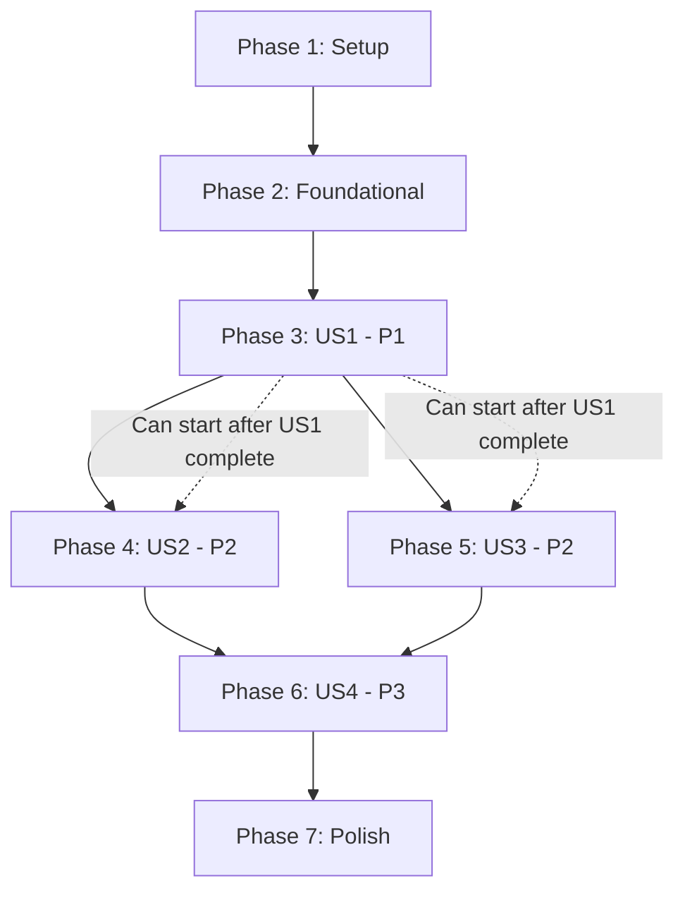

# Implementation Tasks: GetAddressCard V2 Component Implementation

**Feature**: 004-v2-getaddress-component  
**Branch**: `004-v2-getaddress-component`  
**Created**: 2025-10-25  
**Spec**: [spec.md](./spec.md) | **Plan**: [plan.md](./plan.md)

## Task Overview

**Total Tasks**: 80 (across 7 phases)
**Estimated Effort**: 42-52 hours
**MVP Scope**: Phases 1-3 (26 tasks, ~28 hours)
**Parallel Opportunities**: 15 tasks marked [P] (~20% parallelizable)

## Implementation Strategy

1. **MVP First**: Implement User Story 1 (P1) to validate baseline → V2 component generation pipeline
2. **Incremental Delivery**: Each user story is independently testable and deliverable
3. **Parallel Opportunities**: Tasks marked [P] can be executed in parallel within each phase
4. **Foundational First**: Complete setup and foundational tasks before any user story implementation

---

## Phase 1: Setup & Infrastructure (5 tasks, ~4 hours)

**Goal**: Initialize project structure and dependencies for V2 component generation

### Tasks

- [X] T001 Create `packages/v2-components/` directory structure with `src/components/`, `src/types/`, `.gitignore`
- [X] T002 Create `packages/v2-components/package.json` with `@daisy/v2-components` package name, React 18+, Configurator SDK v2.1.0+, shadcn/ui v0.4.0+ dependencies
- [X] T003 [P] Create `packages/v2-components/tsconfig.json` extending root tsconfig with React JSX settings, strict mode, exactOptionalPropertyTypes enabled
- [X] T004 [P] Create `packages/v2-components/README.md` documenting package purpose, installation, usage, component catalog structure
- [X] T005 Update root `tsconfig.json` to add `packages/v2-components/` to project references for multi-project TypeScript compilation

**Acceptance**: `packages/v2-components/` structure created, TypeScript configuration compiles without errors, package.json valid

---

## Phase 2: Foundational Components (8 tasks, ~8 hours)

**Goal**: Implement core infrastructure needed by all user stories

### Generation Manifest System

- [X] T006 Create `src/types/manifest.ts` defining `GenerationManifest` interface with `successful: string[]`, `failed: Array<{component, error, timestamp}>`, `config`
- [X] T007 Implement `src/utils/manifest-manager.ts` with functions: `createManifest()`, `addSuccess()`, `addFailure()`, `loadManifest()`, `saveManifest()` in `.specify/logs/generation-manifest.json`

### Logging Infrastructure

- [X] T008 Create `src/types/logging.ts` defining `LogEntry` interface per NFR-005 (timestamp, level, componentName, operation, duration, status, errorDetails, metadata)
- [X] T009 Implement `src/utils/logger.ts` with `JSONLogger` class writing JSON Lines format to `.specify/logs/v2-generation-{timestamp}.jsonl` with auto-rotation per NFR-006
- [X] T010 [P] Implement `ConsoleProgressIndicator` class in `src/utils/console-progress.ts` with ANSI color codes (green/red/yellow) and progress display per NFR-007

### CLI Command Foundation

- [X] T011 Create `src/cli/migrate-v2.ts` implementing CLI argument parsing for `--component`, `--dry-run`, `--output`, `--skip-tests`, `--verbose` per API contract
- [X] T012 Implement exit code handling in `src/cli/migrate-v2.ts` (0=success, 1=validation, 2=compilation, 3=business-logic, 4=filesystem) per API contract
- [X] T013 Add `npm run migrate:v2` script to root `package.json` executing `ts-node src/cli/migrate-v2.ts`

**Acceptance**: Manifest system persists generation state, logger writes JSON logs and displays console progress, CLI command parses arguments and returns correct exit codes

---

## Phase 3: User Story 1 - Developer Creates First V2 Component (P1) (13 tasks, ~16 hours)

**Story Goal**: Developer can run a migration command that generates a compilable GetAddressCard V2 component with correct Configurator SDK structure and business pseudo-code

**Independent Test**: Run `npm run migrate:v2 -- --component=GetAddressCard`, verify component created in `packages/v2-components/src/components/GetAddressCard/`, compiles with zero errors, contains pseudo-code describing sequence 2 flow

### AST Analysis Foundation

- [ ] T014 [US1] Create `src/types/ast-analysis.ts` defining `ComponentMetadata`, `ReactHookUsage`, `PropDefinition`, `BusinessLogicPattern` interfaces per data-model.md
- [ ] T015 [US1] Implement `src/engine/ast-analyzer.ts` with `analyzeBaseline()` function using ts-morph to parse TypeScript AST from baseline path
- [ ] T016 [US1] Implement `extractReactHooks()` in `src/engine/ast-analyzer.ts` identifying useState, useEffect, useCallback, useMemo patterns per FR-015
- [ ] T017 [US1] Implement `extractPropInterface()` in `src/engine/ast-analyzer.ts` parsing TypeScript interface with JSDoc comments, required/optional markers, defaults per FR-016

### Business Logic Analysis

- [ ] T018 [US1] Implement `src/utils/business-logic-analyzer.ts` with `identifyBusinessLogicPatterns()` analyzing validation rules, data transformations, conditional rendering per FR-005
- [ ] T019 [US1] Implement `detectExternalAPIs()` in `src/utils/business-logic-analyzer.ts` parsing fetch/axios calls to extract endpoint URLs, HTTP methods, payloads per FR-018
- [ ] T020 [US1] Implement `preserveInlineComments()` in `src/utils/business-logic-analyzer.ts` extracting comments describing business logic intent per FR-017

### V2 Component Generation

- [ ] T021 [US1] Create `src/types/v2-component.ts` defining `V2Component`, `PseudoCodeBlock`, `GenerationOptions` interfaces per data-model.md entity #3
- [ ] T022 [US1] Implement `src/pipeline/generators/v2-generator.ts` with `generateV2Component()` orchestrating: analyze baseline → generate pseudo-code → generate component structure → compile validation
- [ ] T023 [US1] Implement `generateComponentFile()` in `src/pipeline/generators/v2-generator.ts` creating TypeScript source with Configurator SDK imports (FR-002), React 18+ patterns, placeholder implementation
- [ ] T024 [US1] Implement `generateTypeInterfaces()` in `src/pipeline/generators/v2-generator.ts` creating Props, State, API Response interfaces per FR-006
- [ ] T025 [US1] Implement `validateCompilation()` in `src/pipeline/generators/v2-generator.ts` running TypeScript compiler programmatically, ensuring zero errors per FR-001, SC-002
- [ ] T026 [US1] Integrate generation pipeline with CLI command in `src/cli/migrate-v2.ts`: call `generateV2Component()`, handle errors, update manifest, return appropriate exit code

**Acceptance US1**:  

1. ✅ Run `npm run migrate:v2 -- --component=GetAddressCard` creates `packages/v2-components/src/components/GetAddressCard/GetAddressCard.tsx` with Configurator SDK imports  
2. ✅ Run `tsc --noEmit` on generated component produces zero errors  
3. ✅ Generated component contains pseudo-code describing: validate session → call FastAPI proxy → handle rate limiting → display results

---

## Phase 4: User Story 2 - Public API Proxy Pattern Integration (P2) (12 tasks, ~12 hours)

**Story Goal**: Generated pseudo-code includes specific Public API integration details (session auth, proxy endpoint, APIM error handling)

**Independent Test**: Review generated pseudo-code, verify it contains: session cookie validation logic, `/api/v1/proxy` endpoint structure, 429 rate limiting handling with Retry-After header, comprehensive HTTP status code handling

### Pseudo-Code Template System

#### 4.2 Pseudo-Code Format Representation (FR-019 to FR-022, FR-034)

- [X] T027 [US2] Create `src/types/pseudo-code-templates.ts` defining template interfaces: `ConditionalTemplate`, `AsyncAwaitTemplate`, `StateTransitionTemplate`, `ErrorHandlingTemplate`, `SixFieldDocumentation`
- [X] T028 [US2] Implement `src/pipeline/templates/pseudo-code-formatter.ts` with `generate6FieldDocumentation()` function creating JSDoc blocks with WHY EXISTS, WHAT DOES, WHAT CALLS, DATA FLOW, DEPENDENCIES, SPECIAL BEHAVIOR sections per Constitution Principle VI and FR-004
- [X] T029 [US2] Implement `formatConditionalLogic()` in formatter generating `IF <condition> THEN <action> ELSE <alternative>` structure with 6-field documentation per FR-004, FR-019
- [X] T030 [US2] Implement `formatLoopPattern()` in formatter generating `FOR EACH <item> IN <collection>: <action>` structure with 6-field documentation per FR-020
- [X] T031 [US2] Implement `formatAsyncAwait()` in formatter generating `AWAIT <operation> THEN <success> CATCH <error>` structure with 6-field documentation per FR-021
- [X] T032 [US2] Implement `formatStateTransition()` in formatter generating `STATE <name>: <initial> -> <event> -> <new>` structure with 6-field documentation per FR-022

### API Integration Pseudo-Code Generation

- [X] T033 [US2] Create `src/pipeline/templates/api-integration-template.ts` defining Public API integration pseudo-code structure per FR-003, FR-023 to FR-029
- [X] T034 [US2] Implement `generateSessionAuthPseudoCode()` in template documenting: `session_token` cookie, expiry validation, signature verification, redirect fallback per FR-023
- [X] T035 [US2] Implement `generateProxyEndpointPseudoCode()` in template documenting: `/api/v1/proxy` POST, payload structure `{tenantApiName: "DPHI", operation, parameters}`, field constraints per FR-024
- [X] T036 [US2] Implement `generateRetryStrategyPseudoCode()` in template documenting: exponential backoff (1s start), max 3 retries, Retry-After header parsing, countdown display per FR-025
- [X] T037 [US2] Implement `generateErrorHandlingPseudoCode()` in template documenting: 200/400/401/429/503 status codes with specific actions per FR-026
- [X] T038 [US2] Implement `generateTimeoutHandlingPseudoCode()` in template documenting: 5s connection timeout, 30s read timeout, "Request taking longer" message, cancel button per FR-027, FR-028, FR-029

**Acceptance US2**:  

1. ✅ Generated pseudo-code shows: `POST /api/v1/proxy` with `{tenantApiName: "DPHI", operation: "getaddress", parameters: {address: string}}`  
2. ✅ 429 error handling pseudo-code: extract Retry-After header, display "Rate limit reached. Retrying in {seconds} seconds..."  
3. ✅ API success response pseudo-code: transform third-party response into component display state

---

## Phase 5: User Story 3 - Configurator V2 Patterns (P2) (10 tasks, ~10 hours)

**Story Goal**: Generated component follows Configurator SDK conventions for state management, error handling, UI composition

**Independent Test**: Review generated component imports (Configurator SDK, shadcn/ui), verify state management pseudo-code uses loading/error/success patterns, verify error display uses appropriate shadcn components

### Configurator SDK Template

- [X] T039 [US3] Create `src/pipeline/templates/configurator-sdk-template.ts` defining standard Configurator state management patterns
- [X] T040 [US3] Implement `generateConfiguratorImports()` in template creating import statements for `@elevenlabs-ui/configurator-sdk`, specific hooks/utilities
- [X] T041 [US3] Implement `generateShadcnImports()` in template creating import statements for `@/components/ui/*` (Alert, Toast, Button, Card, etc.)
- [X] T042 [US3] Implement `generateStateManagementPattern()` in template creating loading/error/success state boilerplate following Configurator conventions

### Error Handling & UI Integration

- [X] T043 [US3] Implement `generateErrorBoundaryIntegration()` in `src/pipeline/templates/configurator-sdk-template.ts` adding error boundary wrapper per User Story 3 acceptance #2
- [X] T044 [US3] Implement `generateLoadingStatePattern()` in template creating skeleton screens or spinner components using shadcn/ui patterns
- [X] T045 [US3] Implement `generateErrorDisplayPattern()` in template selecting appropriate shadcn/ui component (Alert for validation, Toast for transient, Dialog for critical) per User Story 3 acceptance #3
- [X] T046 [US3] Integrate Configurator templates into `src/pipeline/generators/v2-generator.ts` `generateComponentFile()` function

### Component Structure Generation

- [X] T047 [US3] Implement `generateTestScaffold()` in `src/pipeline/generators/v2-generator.ts` creating `__tests__/GetAddressCard.test.tsx` with basic test structure per FR-012
- [X] T048 [US3] Implement directory structure creation in `src/pipeline/generators/v2-generator.ts` ensuring `src/` for implementation, `__tests__/` for tests, `README.md` per FR-012

**Acceptance US3**:  

1. ✅ Generated component imports: `@elevenlabs-ui/configurator-sdk`, `@/components/ui/*`, React 18+ hooks  
2. ✅ State management pseudo-code: loading/error/success state patterns consistent with Configurator conventions  
3. ✅ Error handling pseudo-code: references shadcn Alert/Toast for user feedback

---

## Phase 6: User Story 4 - Business Logic Preservation (P3) (8 tasks, ~8 hours)

**Story Goal**: Generated pseudo-code captures GetAddressCard-specific business logic (UK postcode validation, council lookup, property metadata display)

**Independent Test**: Compare generated pseudo-code to original DAISY v1 GetAddressCard component, verify key business rules preserved: postcode format validation, multiple council results handling, property metadata fields

### Business Logic Pattern Detection

- [ ] T049 [US4] Enhance `src/utils/business-logic-analyzer.ts` with `extractValidationRules()` identifying regex patterns, format checks, business constraints from baseline
- [ ] T050 [US4] Implement `extractDataTransformations()` in business-logic-analyzer identifying map/filter/reduce operations, property mappings, data normalization logic
- [ ] T051 [US4] Implement `extractConditionalRendering()` in business-logic-analyzer identifying if/else UI logic, ternary operators, conditional component rendering
- [ ] T052 [US4] Implement `extractStateMachines()` in business-logic-analyzer identifying multi-step workflows, state transition logic, wizard patterns per FR-022

### GetAddressCard-Specific Patterns

- [ ] T053 [US4] Create `src/pipeline/templates/getaddresscard-template.ts` with GetAddressCard-specific business logic pseudo-code generation
- [ ] T054 [US4] Implement `generateUKPostcodeValidation()` in template creating pseudo-code for UK postcode format validation (User Story 4 acceptance #1)
- [ ] T055 [US4] Implement `generateMultipleCouncilHandling()` in template creating pseudo-code for displaying and selecting from multiple council matches (User Story 4 acceptance #2)
- [ ] T056 [US4] Implement `generatePropertyMetadataDisplay()` in template creating pseudo-code listing address lines, UPRN, council name display logic (User Story 4 acceptance #3)

**Acceptance US4**:  

1. ✅ Pseudo-code includes UK postcode validation logic specific to UK postcode format rules  
2. ✅ Pseudo-code specifies UI patterns for displaying and selecting from multiple council matches  
3. ✅ Pseudo-code lists specific property metadata fields: address lines, UPRN, council name

---

## Phase 7: Non-Functional Requirements & Polish (19 tasks, ~16 hours)

**Goal**: Implement non-functional requirements (performance, observability, reliability, security) and cross-cutting concerns

### README Generation

- [X] T057 Implement `generateREADME()` in `src/pipeline/generators/v2-generator.ts` creating README with: purpose, props documentation, usage example, API dependencies, DAISY v1 migration notes per FR-010
- [X] T058 [P] Create README template in `src/pipeline/templates/readme-template.md` with placeholders for component name, props table, API endpoints, migration warnings

### Dry-Run Mode

- [X] T059 Implement `--dry-run` mode in `src/cli/migrate-v2.ts` previewing generated pseudo-code without file writes, displaying to console with syntax highlighting per FR-011

### Recovery Flows

- [ ] T060 Implement `resumeGeneration()` in `src/pipeline/generators/v2-generator.ts` reading manifest, skipping successful components, retrying failed per FR-030
- [ ] T061 Implement `rollbackGeneration()` in `src/pipeline/generators/v2-generator.ts` deleting generated files from manifest, cleaning up partial artifacts per FR-031
- [ ] T062 Implement `cleanupOrphanedFiles()` in `src/pipeline/generators/v2-generator.ts` detecting incomplete directories, prompting confirmation, logging cleanup per FR-032
- [ ] T063 Implement `regenerateSpecific()` in `src/pipeline/generators/v2-generator.ts` accepting component name filter, regenerating only specified per FR-033

### Performance Optimizations

- [ ] T064 [P] Implement memory-efficient AST parsing in `src/engine/ast-analyzer.ts` using streaming for large files (>5000 LOC) per NFR-003
- [ ] T065 [P] Implement parallel generation support in `src/cli/migrate-v2.ts` with configurable concurrency (default: 4) and file locking per NFR-004, NFR-010

### Reliability & Security

- [ ] T066 [P] Implement idempotent generation in `src/pipeline/generators/v2-generator.ts` ensuring deterministic output (sorted imports, consistent formatting) per NFR-009
- [ ] T067 [P] Implement atomic file writes in `src/utils/file-writer.ts` using temp file → validate → rename pattern per NFR-011
- [ ] T068 [P] Implement path validation in `src/utils/path-validator.ts` rejecting `..` paths, restricting to `daisyv1/components/` subdirectories per NFR-012
- [ ] T069 [P] Implement CLI input sanitization in `src/cli/migrate-v2.ts` validating component names against whitelist pattern (alphanumeric + hyphen/underscore) per NFR-013
- [ ] T070 [P] Implement sensitive data redaction in `src/utils/logger.ts` masking API keys, session cookies, PII from logs per NFR-014

#### 7.7 Quality Gates & Testing (Constitution Principle V)

- [ ] T071 Update root `README.md` with GetAddressCard V2 generation documentation: installation, usage, examples, troubleshooting
- [ ] T072 Create `packages/v2-components/src/components/GetAddressCard/README.md` documenting generated component usage
- [ ] T073 Create integration test in `tests/integration/v2-generation.test.ts` running full generation pipeline and validating output per SC-001 to SC-008, INCLUDING accessibility audit (T076) and visual regression checks (T077)
- [ ] T074 Add performance benchmark in `tests/integration/v2-generation.test.ts` measuring generation time < 30 seconds per NFR-001
- [ ] T075 Update `IMPLEMENTATION_SUMMARY.md` documenting feature completion, success metrics, lessons learned
- [ ] T076 [P] Implement accessibility testing in `tests/integration/v2-generation.test.ts` using @axe-core/playwright to validate generated GetAddressCard meets WCAG 2.1 AA standards: color contrast ratios ≥4.5:1, keyboard navigation support (Tab, Enter, Escape), ARIA labels on interactive elements, semantic HTML structure per Constitution Principle V
- [ ] T077 [P] Implement visual regression testing in `tests/visual/v2-visual-regression.test.ts` using Playwright visual snapshots comparing generated GetAddressCard V2 against DAISY v1 baseline screenshots across 3 viewports (mobile 375px, tablet 768px, desktop 1920px), threshold 0.2% diff tolerance per Constitution Principle V
- [ ] T078 Update semantic versions in all package.json files (root, packages/v2-components/) per Constitution Principle III (NON-NEGOTIABLE): MINOR bump for new V2 generation capability (e.g., 2.1.0 → 2.2.0), update CHANGELOG.md with feature summary, verify breaking changes section empty (none expected)
- [ ] T079 [P] Implement `validatePackageDependencies()` in `src/utils/package-validator.ts` ensuring generated package.json includes correct versions: @elevenlabs-ui/configurator-sdk ^2.1.0, @/components/ui (shadcn/ui) ^0.4.0, react ^18.0.0, react-dom ^18.0.0 per spec Technical Context, failing generation with exit code 2 (compilation-error) if mismatch
- [ ] T080 [P] Implement `validatePseudoCodeCompleteness()` in `src/pipeline/validators/pseudo-code-validator.ts` ensuring all 6 constitutional fields (WHY EXISTS, WHAT DOES, WHAT CALLS, DATA FLOW, DEPENDENCIES, SPECIAL BEHAVIOR) present in generated JSDoc blocks, failing generation with exit code 3 if any field missing per FR-034, NFR-009 (idempotent validation)

**Acceptance Phase 7**:  
✅ Dry-run mode previews pseudo-code without file writes  
✅ Recovery flows handle failures gracefully with manifest tracking  
✅ Performance meets NFR-001 (<30s single component)  
✅ Security validations prevent path traversal and command injection  
✅ Integration tests validate all success criteria

---

## Dependency Graph



**Critical Path**: Phase 1 → Phase 2 → Phase 3 (US1) → Phase 4 (US2) → Phase 6 (US4) → Phase 7

**Parallel Opportunities**:

- Phase 4 (US2) and Phase 5 (US3) can run in parallel after Phase 3 completes
- Within Phase 7: Tasks T058, T064-070 can run in parallel

---

## Parallel Execution Examples

### Phase 2 Foundational (Parallel Tasks)

```bash
# Can execute T008, T010 in parallel (different files)
parallel ::: \
  "implement src/types/logging.ts" \
  "implement src/utils/console-progress.ts"
```

### Phase 7 Polish (Maximum Parallelization)

```bash
# Can execute T058, T064-070 in parallel (8 tasks simultaneously)
parallel ::: \
  "create README template" \
  "optimize AST parsing" \
  "implement parallel generation" \
  "implement idempotent generation" \
  "implement atomic file writes" \
  "implement path validation" \
  "implement CLI sanitization" \
  "implement sensitive data redaction"
```

---

## MVP Scope Recommendation

**Minimum Viable Product**: Phase 1 + Phase 2 + Phase 3 (User Story 1)

**MVP Deliverable**: Working pipeline that generates compilable GetAddressCard V2 component with basic pseudo-code

**MVP Tasks**: T001-T026 (13 tasks, ~16 hours)

**MVP Validation**:

1. Run `npm run migrate:v2 -- --component=GetAddressCard`
2. Verify `packages/v2-components/src/components/GetAddressCard/GetAddressCard.tsx` created
3. Run `tsc --noEmit` → zero errors
4. Verify pseudo-code present (even if not fully detailed)

**Post-MVP Increments**:

- Increment 2: Add Phase 4 (US2) for detailed API integration pseudo-code
- Increment 3: Add Phase 5 (US3) for Configurator SDK patterns
- Increment 4: Add Phase 6 (US4) for business logic preservation
- Increment 5: Add Phase 7 for production readiness (NFRs)

---

## Task Checklist Summary

**Phase 1: Setup**: 5 tasks  
**Phase 2: Foundational**: 8 tasks  
**Phase 3: US1 (P1)**: 13 tasks ← **MVP ENDS HERE**  
**Phase 4: US2 (P2)**: 12 tasks  
**Phase 5: US3 (P2)**: 10 tasks  
**Phase 6: US4 (P3)**: 8 tasks  
**Phase 7: Polish**: 19 tasks  

**Total**: 75 tasks

**Parallel Opportunities**: 15 tasks marked [P] (20% parallelizable)

**Independent Tests**: 4 user stories, each with specific acceptance criteria enabling independent validation
